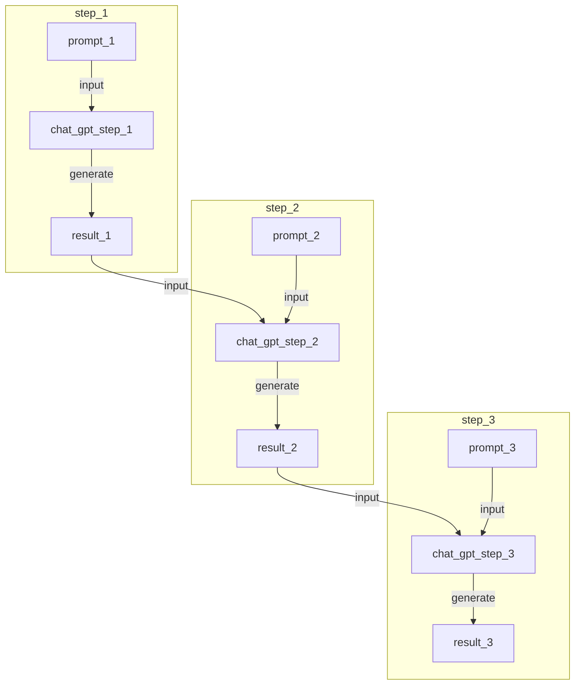

## Chain of Prompts

Here is how it suppose to work:

```mermaid
flowchart TD
   subgraph step_1
        prompt_1 --input--> chat_gpt_step_1
        chat_gpt_step_1 --generate--> result_1
    end

    subgraph step_2
        result_1 --input--> chat_gpt_step_2
        prompt_2 --input--> chat_gpt_step_2
        chat_gpt_step_2 --generate--> result_2
    end

    subgraph step_3
        result_2 --input--> chat_gpt_step_3
        prompt_3 --input--> chat_gpt_step_3
        chat_gpt_step_3 --generate--> result_3
    end
```